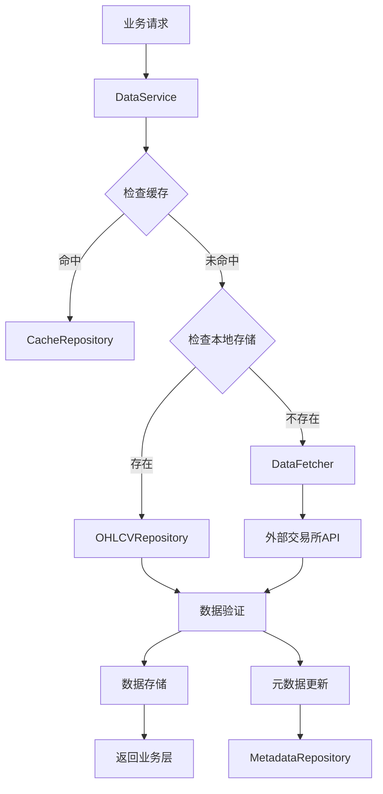
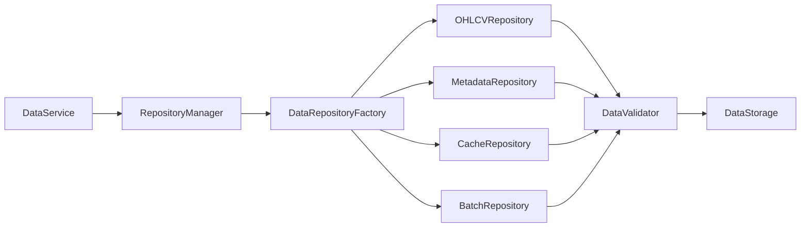

# 数据模块架构文档

## 📋 概述

数据模块是ProCryptoTrader量化交易系统的数据基础设施，严格遵循RIPER-5原则设计，实现了从数据获取到存储、验证、处理的完整数据链路。采用传统组件与Repository模式并行的双层架构，确保系统的高可用性、高性能和可扩展性。

## 🎯 RIPER-5原则体现

### Risk First (风险优先)
- **数据安全**: 多重备份机制，防止数据丢失
- **质量验证**: 完整的数据验证和质量评分系统
- **错误恢复**: 自动重试、降级策略和数据修复机制
- **监控告警**: 全面的数据质量监控和异常检测

### Integration Minimal (最小侵入)
- **松耦合设计**: 基于接口抽象，支持多种数据源无缝切换
- **适配器模式**: 统一的数据访问接口，隐藏底层实现复杂性
- **服务网关**: DataService作为统一入口，最小化业务系统与数据层的耦合

### Predictability (可预期性)
- **标准化数据模型**: 统一的OHLCV数据结构和元数据规范
- **一致性接口**: Repository模式提供可预期的数据操作行为
- **确定性结果**: 相同输入总是产生相同输出，保证回测结果的可重现性

### Expandability (可扩展性)
- **工厂模式**: 支持新数据源和存储后端的动态扩展
- **插件化架构**: Repository层支持插件式功能扩展
- **配置驱动**: 通过配置文件灵活控制数据行为，无需代码修改

### Realistic Evaluation (真实可评估)
- **性能指标**: 详细的缓存命中率、存储统计、操作耗时监控
- **质量评分**: 0-1分数据质量评分，可量化的数据质量评估
- **基准测试**: 完整的性能基准测试和回归测试框架

## 🏗️ 模块架构

### 目录结构
```
core/data/
├── data_fetcher.py              # 数据获取服务
├── data_manager.py              # 数据管理器 (传统架构)
├── data_loader.py               # 数据加载器
├── data_processor.py            # 数据处理器
├── data_storage.py              # 数据存储抽象层
├── data_service.py              # 统一数据访问服务
├── data_validator.py            # 数据验证器
├── data_downloader.py           # 数据下载管理器
├── performance_data_manager.py  # 性能优化的数据管理器
└── repositories/                # Repository模式实现
    ├── __init__.py
    ├── base_repository.py       # 仓储抽象基类
    ├── ohlcv_repository.py      # OHLCV数据仓储
    ├── metadata_repository.py   # 元数据仓储
    ├── cache_repository.py      # 缓存仓储
    ├── batch_repository.py      # 批量处理仓储
    ├── data_factory.py          # 仓储工厂
    └── repository_manager.py    # 仓储管理器
```

### 架构层次
```
应用层接口 (Application Interface)
    ↓
服务网关层 (Service Gateway)
    ↓
Repository管理层 (Repository Management)
    ↓
Repository实现层 (Repository Implementation)
    ↓
存储抽象层 (Storage Abstraction)
    ↓
物理存储层 (Physical Storage)
```

## 🔄 数据流向

### 标准数据获取流程


### Repository模式数据流


## 📊 核心组件详解

### 1. 数据获取层 (Data Acquisition)

#### DataFetcher 类
**职责**: 从交易所API获取原始数据的统一入口

**核心特性**:
- **多交易所支持**: 基于ccxt库，支持Binance、OKX等主流交易所
- **智能重试**: 指数退避算法，自动处理网络波动
- **并发获取**: 支持多交易对并发数据获取
- **数据预处理**: 自动数据类型转换和基础验证

**公共接口**:
```python
def fetch_ohlcv(
    self,
    symbol: str,                           # 交易对符号
    timeframe: str = '1h',                 # 时间框架
    limit: int = 500,                      # 数据条数限制
    since: Optional[int] = None,           # 开始时间戳
    params: Optional[Dict] = None,         # 额外参数
    max_retries: int = 3,                  # 最大重试次数
    retry_delay: float = 1.0              # 重试延迟
) -> pd.DataFrame

def fetch_multiple_symbols(
    self,
    symbols: List[str],                    # 交易对列表
    timeframe: str = '1h',
    limit: int = 500,
    since: Optional[int] = None
) -> Dict[str, pd.DataFrame]

def get_exchange_info(self) -> Dict[str, Any]
def get_timeframes(self) -> List[str]
def get_symbols(self) -> List[str]
```

**使用示例**:
```python
fetcher = DataFetcher(exchange_name='binance')
ohlcv_data = fetcher.fetch_ohlcv('BTC/USDT', '1h', limit=1000)
multiple_data = fetcher.fetch_multiple_symbols(['BTC/USDT', 'ETH/USDT'], '1h')
```

#### DataDownloader 类
**职责**: 批量数据下载管理，支持多交易所策略

**核心功能**:
- **工厂模式**: 根据交易所名称创建对应的下载策略
- **批量操作**: 支持多交易对、多时间框架的批量下载
- **数据验证**: 自动验证下载数据的完整性
- **模拟数据生成**: 用于测试环境的模拟数据生成

**公共接口**:
```python
def __init__(self, exchange_name: str, config: Dict[str, Any] = None)

def download_historical_data(
    self,
    symbols: List[str],
    timeframes: List[str],
    start_date: str,
    end_date: str,
    save_path: str
) -> Dict[str, Any]

def validate_data(self, data: pd.DataFrame) -> bool
def generate_sample_data(
    self,
    symbol: str,
    start_date: str,
    end_date: str
) -> pd.DataFrame
```

### 2. Repository模式层

#### BaseRepository 抽象基类
**职责**: 定义Repository模式的统一接口和行为规范

**设计理念**:
- **抽象接口**: 定义标准的CRUD操作
- **数据验证**: 集成DataValidator进行统一验证
- **批量操作**: 支持批量数据操作提升性能
- **工具方法**: 提供通用的数据处理工具

**抽象接口**:
```python
@abstractmethod
def save(
    self,
    data: pd.DataFrame,
    symbol: str,
    timeframe: str,
    **kwargs
) -> bool

@abstractmethod
def load(
    self,
    symbol: str,
    timeframe: str,
    start_time: Optional[datetime] = None,
    end_time: Optional[datetime] = None,
    **kwargs
) -> pd.DataFrame

@abstractmethod
def delete(
    self,
    symbol: str,
    timeframe: str,
    **kwargs
) -> bool

@abstractmethod
def exists(
    self,
    symbol: str,
    timeframe: str,
    **kwargs
) -> bool

# 批量操作接口
def batch_save(
    self,
    data_dict: Dict[str, Dict[str, pd.DataFrame]],
    **kwargs
) -> Dict[str, Dict[str, bool]]

def batch_load(
    self,
    requests: List[Dict[str, Any]],
    **kwargs
) -> List[pd.DataFrame]
```

**工具方法**:
```python
def validate_data(self, data: pd.DataFrame) -> bool
def get_time_range(self, data: pd.DataFrame) -> Tuple[datetime, datetime]
def generate_cache_key(self, symbol: str, timeframe: str, **kwargs) -> str
```

#### OHLCVRepository 类
**职责**: OHLCV数据的专业化存储和检索

**核心特性**:
- **高效存储**: 基于Parquet格式，支持列式压缩
- **智能缓存**: 内存缓存层，提升频繁访问性能
- **数据合并**: 自动处理数据的增量更新和合并
- **时间过滤**: 高效的时间范围查询和过滤

**存储策略**:
```python
# 文件路径: data/{exchange}/{symbol}/{timeframe}.parquet
# 示例: data/binance/BTC-USDT/1h.parquet

def get_file_path(self, symbol: str, timeframe: str) -> Path:
    """生成标准化的文件路径"""
    safe_symbol = symbol.replace('/', '-')
    return self.data_dir / self.exchange / safe_symbol / f"{timeframe}.parquet"
```

**缓存机制**:
```python
def _generate_cache_key(
    self,
    symbol: str,
    timeframe: str,
    start_time: Optional[datetime],
    end_time: Optional[datetime]
) -> str:
    """生成缓存键，支持时间范围查询"""
    key_parts = [symbol, timeframe]
    if start_time:
        key_parts.append(start_time.isoformat())
    if end_time:
        key_parts.append(end_time.isoformat())
    return ":".join(key_parts)
```

**性能优化**:
```python
def get_storage_stats(self) -> Dict[str, Any]:
    """获取存储统计信息"""
    return {
        'total_files': len(list(self.data_dir.rglob("*.parquet"))),
        'total_size_mb': sum(f.stat().st_size for f in self.data_dir.rglob("*.parquet")) / (1024 * 1024),
        'cache_hit_rate': self.cache_hits / (self.cache_hits + self.cache_misses) if (self.cache_hits + self.cache_misses) > 0 else 0,
        'avg_load_time_ms': self.total_load_time / self.load_count if self.load_count > 0 else 0
    }
```

#### MetadataRepository 类
**职责**: 数据元信息管理和质量监控

**元数据模型**:
```python
@dataclass
class DataMetadata:
    symbol: str                           # 交易对符号
    timeframe: str                        # 时间框架
    version: str                          # 数据版本
    source: str                           # 数据来源
    quality_score: float                  # 质量评分 (0-1)
    completeness: float                   # 完整性评分
    created_at: datetime                  # 创建时间
    updated_at: datetime                  # 更新时间
    row_count: int                        # 数据行数
    date_range: Tuple[datetime, datetime] # 数据时间范围
    null_counts: Dict[str, int]           # 各列空值统计
    tags: List[str] = field(default_factory=list)          # 标签
    description: str = ""                 # 描述
    custom_fields: Dict[str, Any] = field(default_factory=dict)  # 自定义字段
```

**核心功能**:
```python
def save_metadata(self, metadata: DataMetadata) -> bool
def load_metadata(self, symbol: str, timeframe: str) -> Optional[DataMetadata]
def update_metadata(self, symbol: str, timeframe: str, **updates) -> bool
def delete_metadata(self, symbol: str, timeframe: str) -> bool
def search_metadata(self, query: str) -> List[DataMetadata]
def get_data_quality_report(self) -> Dict[str, Any]
```

**质量评估**:
```python
def calculate_quality_score(self, data: pd.DataFrame) -> float:
    """计算数据质量评分 (0-1)"""
    scores = []

    # 完整性检查 (30%)
    completeness = 1 - (data.isnull().sum().sum() / (len(data) * len(data.columns)))
    scores.append(completeness * 0.3)

    # 唯一性检查 (20%)
    uniqueness = len(data.drop_duplicates()) / len(data)
    scores.append(uniqueness * 0.2)

    # 逻辑一致性检查 (30%)
    logic_score = self._check_ohlcv_logic(data)
    scores.append(logic_score * 0.3)

    # 时间连续性检查 (20%)
    time_score = self._check_time_continuity(data)
    scores.append(time_score * 0.2)

    return sum(scores)
```

#### CacheRepository 类
**职责**: 高性能数据缓存层

**缓存策略**:
```python
@dataclass
class CacheConfig:
    ttl: int = 300                       # 生存时间 (秒)
    max_size: int = 1000                 # 最大缓存条目数
    cleanup_interval: int = 60           # 清理间隔 (秒)
    serialization_method: str = "parquet" # 序列化方法
    compression: bool = True             # 是否启用压缩
```

**序列化优化**:
```python
def _serialize_data(self, data: pd.DataFrame) -> Dict[str, Any]:
    """优化的DataFrame序列化，保持数据类型和索引"""
    return {
        'data': data.to_parquet(index=True),  # 保持索引
        'dtypes': data.dtypes.to_dict(),      # 保存数据类型
        'index_name': data.index.name,        # 索引名称
        'columns': list(data.columns),        # 列名
        'shape': data.shape,                  # 数据形状
        'timestamp': datetime.utcnow().isoformat()
    }

def _deserialize_data(self, serialized: Dict[str, Any]) -> pd.DataFrame:
    """反序列化，恢复完整的DataFrame"""
    import io
    data = pd.read_parquet(io.BytesIO(serialized['data']))
    return data
```

**缓存管理**:
```python
def invalidate_symbol(self, symbol: str) -> int:
    """清理指定交易对的所有缓存"""
    invalidated = 0
    keys_to_remove = []

    for key in self.cache.keys():
        if key.startswith(f"{symbol}:"):
            keys_to_remove.append(key)

    for key in keys_to_remove:
        del self.cache[key]
        invalidated += 1

    return invalidated

def warm_cache(self, symbols: List[str], timeframes: List[str]) -> Dict[str, bool]:
    """缓存预热，主动加载常用数据"""
    results = {}
    for symbol in symbols:
        for timeframe in timeframes:
            key = f"{symbol}:{timeframe}"
            try:
                if key not in self.cache:
                    data = self.ohlcv_repo.load(symbol, timeframe)
                    if not data.empty:
                        self.cache[key] = self._serialize_data(data)
                        results[key] = True
                    else:
                        results[key] = False
            except Exception:
                results[key] = False

    return results
```

#### BatchRepository 类
**职责**: 大数据量批量处理专家

**并发处理**:
```python
def batch_save(
    self,
    data_dict: Dict[str, Dict[str, pd.DataFrame]],
    max_workers: int = 4,
    timeout: Optional[float] = None,
    progress_callback: Optional[Callable[[int, int], None]] = None
) -> Dict[str, Dict[str, bool]]:
    """并发批量保存数据"""

    def save_worker(args):
        symbol, timeframe, data = args
        try:
            return self.ohlcv_repo.save(data, symbol, timeframe)
        except Exception as e:
            self.logger.error(f"保存失败 {symbol}/{timeframe}: {e}")
            return False

    # 准备工作项
    work_items = [
        (symbol, timeframe, data)
        for symbol, timeframe_dict in data_dict.items()
        for timeframe, data in timeframe_dict.items()
    ]

    results = {}
    completed = 0
    total = len(work_items)

    with ThreadPoolExecutor(max_workers=max_workers) as executor:
        future_to_item = {
            executor.submit(save_worker, item): item
            for item in work_items
        }

        for future in as_completed(future_to_item, timeout=timeout):
            item = future_to_item[future]
            symbol, timeframe, _ = item

            try:
                success = future.result()
                if symbol not in results:
                    results[symbol] = {}
                results[symbol][timeframe] = success

            except Exception as e:
                if symbol not in results:
                    results[symbol] = {}
                results[symbol][timeframe] = False
                self.logger.error(f"批量保存异常 {symbol}/{timeframe}: {e}")

            completed += 1
            if progress_callback:
                progress_callback(completed, total)

    return results
```

**分块处理**:
```python
def chunk_data(
    self,
    data: pd.DataFrame,
    chunk_size: int = 10000
) -> List[pd.DataFrame]:
    """大数据集分块处理"""
    if len(data) <= chunk_size:
        return [data]

    chunks = []
    for i in range(0, len(data), chunk_size):
        chunk = data.iloc[i:i + chunk_size].copy()
        chunks.append(chunk)

    return chunks

def batch_validate(
    self,
    data_dict: Dict[str, Dict[str, pd.DataFrame]],
    chunk_size: int = 10000
) -> Dict[str, Dict[str, float]]:
    """批量数据验证，支持大数据集"""
    results = {}

    for symbol, timeframe_dict in data_dict.items():
        results[symbol] = {}
        for timeframe, data in timeframe_dict.items():

            # 大数据集分块验证
            if len(data) > chunk_size:
                chunks = self.chunk_data(data, chunk_size)
                chunk_scores = []

                for chunk in chunks:
                    score = self.validator.get_data_quality_score(chunk)
                    chunk_scores.append(score)

                # 使用平均分作为整体质量评分
                results[symbol][timeframe] = sum(chunk_scores) / len(chunk_scores)
            else:
                results[symbol][timeframe] = self.validator.get_data_quality_score(data)

    return results
```

### 3. 服务网关层

#### DataService 类
**职责**: 统一的数据访问服务网关

**数据获取策略**:
```python
class DataService:
    def __init__(self, config: Dict[str, Any] = None):
        self.preferred_sources = ['cache', 'local', 'remote']  # 数据源优先级
        self.repository_manager = RepositoryManager(config)
        self.data_fetcher = DataFetcher()
        self.stats = ServiceStats()  # 服务统计
```

**统一数据访问接口**:
```python
def get_ohlcv_data(
    self,
    symbol: str,
    timeframe: str,
    limit: Optional[int] = None,
    start_time: Optional[datetime] = None,
    end_time: Optional[datetime] = None,
    use_cache: bool = True,
    update_cache: bool = True
) -> pd.DataFrame:
    """统一的OHLCV数据获取接口"""

    # 1. 检查缓存 (如果启用)
    if use_cache:
        cache_data = self._try_get_from_cache(symbol, timeframe, start_time, end_time)
        if cache_data is not None:
            self.stats.record_cache_hit()
            return self._apply_limit(cache_data, limit)

    # 2. 检查本地存储
    local_data = self._try_get_from_local(symbol, timeframe, start_time, end_time)
    if local_data is not None:
        self.stats.record_local_hit()

        # 更新缓存
        if update_cache and use_cache:
            self._update_cache(symbol, timeframe, local_data)

        return self._apply_limit(local_data, limit)

    # 3. 从远程获取
    remote_data = self._try_get_from_remote(symbol, timeframe, start_time, end_time, limit)
    if remote_data is not None:
        self.stats.record_remote_hit()

        # 保存到本地
        self._save_to_local(symbol, timeframe, remote_data)

        # 更新缓存
        if update_cache and use_cache:
            self._update_cache(symbol, timeframe, remote_data)

        return remote_data

    # 4. 数据获取失败
    raise DataNotFoundError(f"无法获取数据: {symbol}/{timeframe}")

def batch_operations(
    self,
    operations: List[Dict[str, Any]],
    max_workers: int = 4
) -> List[Any]:
    """批量操作接口"""

    with ThreadPoolExecutor(max_workers=max_workers) as executor:
        futures = []

        for operation in operations:
            op_type = operation.get('type')

            if op_type == 'get_data':
                future = executor.submit(
                    self.get_ohlcv_data,
                    **operation.get('params', {})
                )
            elif op_type == 'save_data':
                future = executor.submit(
                    self.save_data,
                    **operation.get('params', {})
                )
            elif op_type == 'validate_data':
                future = executor.submit(
                    self.validate_data,
                    **operation.get('params', {})
                )

            futures.append(future)

        results = []
        for future in as_completed(futures):
            try:
                result = future.result()
                results.append(result)
            except Exception as e:
                results.append({'error': str(e)})

        return results
```

**服务监控**:
```python
@dataclass
class ServiceStats:
    cache_hits: int = 0
    local_hits: int = 0
    remote_hits: int = 0
    total_requests: int = 0
    total_errors: int = 0
    avg_response_time: float = 0.0

    def get_cache_hit_rate(self) -> float:
        """缓存命中率"""
        if self.total_requests == 0:
            return 0.0
        return self.cache_hits / self.total_requests

    def get_local_hit_rate(self) -> float:
        """本地存储命中率"""
        if self.total_requests == 0:
            return 0.0
        return (self.cache_hits + self.local_hits) / self.total_requests

    def get_error_rate(self) -> float:
        """错误率"""
        if self.total_requests == 0:
            return 0.0
        return self.total_errors / self.total_requests
```

### 4. 传统组件层

#### DataManager 类
**职责**: 传统架构的数据管理核心

**核心功能**:
```python
def save_data(
    self,
    df: pd.DataFrame,
    symbol: str,
    timeframe: str,
    overwrite: bool = False
) -> bool:
    """保存数据到本地存储"""
    try:
        # 数据验证
        if not self._validate_dataframe(df):
            return False

        # 处理重复数据
        if not overwrite:
            existing_data = self.load_data(symbol, timeframe)
            if not existing_data.empty:
                df = self._merge_data(existing_data, df)

        # 排序和去重
        df = df.sort_index().drop_duplicates()

        # 保存到文件
        file_path = self._get_file_path(symbol, timeframe)
        file_path.parent.mkdir(parents=True, exist_ok=True)

        df.to_parquet(file_path, index=True)

        self.logger.info(f"数据已保存: {symbol}/{timeframe}, {len(df)} 行")
        return True

    except Exception as e:
        self.logger.error(f"保存数据失败: {e}")
        return False

def update_data(
    self,
    symbol: str,
    timeframe: str,
    limit: int = 500
) -> bool:
    """增量更新数据"""
    try:
        # 获取现有数据的最新时间
        existing_data = self.load_data(symbol, timeframe)
        if not existing_data.empty:
            last_time = existing_data.index.max()
            since = int(last_time.timestamp() * 1000)
        else:
            since = None

        # 获取新数据
        fetcher = DataFetcher()
        new_data = fetcher.fetch_ohlcv(symbol, timeframe, limit=limit, since=since)

        if not new_data.empty:
            # 合并数据
            combined_data = pd.concat([existing_data, new_data]).sort_index()
            combined_data = combined_data.drop_duplicates()

            # 保存
            return self.save_data(combined_data, symbol, timeframe, overwrite=True)

        return True

    except Exception as e:
        self.logger.error(f"更新数据失败: {e}")
        return False
```

#### DataProcessor 类
**职责**: 数据清洗、转换和特征工程

**技术指标计算**:
```python
def add_technical_indicators(self, data: pd.DataFrame) -> pd.DataFrame:
    """添加技术指标"""
    df = data.copy()

    # 简单移动平均线
    for window in [5, 10, 20, 50]:
        df[f'sma_{window}'] = df['close'].rolling(window=window).mean()

    # 指数移动平均线
    for window in [12, 26]:
        df[f'ema_{window}'] = df['close'].ewm(span=window).mean()

    # RSI (相对强弱指数)
    delta = df['close'].diff()
    gain = (delta.where(delta > 0, 0)).rolling(window=14).mean()
    loss = (-delta.where(delta < 0, 0)).rolling(window=14).mean()
    rs = gain / loss
    df['rsi'] = 100 - (100 / (1 + rs))

    # MACD
    ema_12 = df['close'].ewm(span=12).mean()
    ema_26 = df['close'].ewm(span=26).mean()
    df['macd'] = ema_12 - ema_26
    df['macd_signal'] = df['macd'].ewm(span=9).mean()
    df['macd_histogram'] = df['macd'] - df['macd_signal']

    # 布林带
    df['bb_middle'] = df['close'].rolling(window=20).mean()
    bb_std = df['close'].rolling(window=20).std()
    df['bb_upper'] = df['bb_middle'] + (bb_std * 2)
    df['bb_lower'] = df['bb_middle'] - (bb_std * 2)

    # ATR (平均真实范围)
    high_low = df['high'] - df['low']
    high_close = abs(df['high'] - df['close'].shift())
    low_close = abs(df['low'] - df['close'].shift())
    tr = pd.concat([high_low, high_close, low_close], axis=1).max(axis=1)
    df['atr'] = tr.rolling(window=14).mean()

    return df

def clean_data(self, data: pd.DataFrame) -> pd.DataFrame:
    """数据清洗"""
    df = data.copy()

    # 移除重复的索引
    df = df[~df.index.duplicated(keep='first')]

    # 处理缺失值
    df = self._handle_missing_values(df)

    # 处理异常值
    df = self._handle_outliers(df)

    # 验证OHLC逻辑
    df = self._validate_ohlc_logic(df)

    return df

def _handle_missing_values(self, df: pd.DataFrame) -> pd.DataFrame:
    """处理缺失值"""
    # 对于价格数据，使用前向填充
    price_columns = ['open', 'high', 'low', 'close']
    df[price_columns] = df[price_columns].fillna(method='ffill')

    # 对于成交量，使用0填充
    df['volume'] = df['volume'].fillna(0)

    # 移除仍然存在的NaN行
    df = df.dropna()

    return df

def _validate_ohlc_logic(self, df: pd.DataFrame) -> pd.DataFrame:
    """验证OHLC逻辑"""
    # 确保high >= max(open, close) 且 low <= min(open, close)
    df['high'] = df[['high', 'open', 'close']].max(axis=1)
    df['low'] = df[['low', 'open', 'close']].min(axis=1)

    # 确保high >= low
    invalid_rows = df['high'] < df['low']
    if invalid_rows.any():
        self.logger.warning(f"发现 {invalid_rows.sum()} 行无效的OHLC数据，已自动修正")
        df.loc[invalid_rows, 'high'] = df.loc[invalid_rows, 'low']

    return df
```

#### DataValidator 类
**职责**: 全面的数据质量验证

**验证维度**:
```python
def validate_ohlc_data(self, data: pd.DataFrame) -> Dict[str, Any]:
    """验证OHLC数据的完整性和正确性"""
    validation_result = {
        'is_valid': True,
        'errors': [],
        'warnings': [],
        'quality_score': 1.0,
        'statistics': {}
    }

    # 1. 基础结构验证
    required_columns = ['open', 'high', 'low', 'close', 'volume']
    missing_columns = [col for col in required_columns if col not in data.columns]
    if missing_columns:
        validation_result['is_valid'] = False
        validation_result['errors'].append(f"缺失必要列: {missing_columns}")

    # 2. 数据类型验证
    numeric_columns = ['open', 'high', 'low', 'close', 'volume']
    for col in numeric_columns:
        if col in data.columns and not pd.api.types.is_numeric_dtype(data[col]):
            validation_result['warnings'].append(f"列 {col} 不是数值类型")

    # 3. 逻辑一致性验证
    if not data.empty:
        # OHLC逻辑验证
        ohlc_invalid = (
            (data['high'] < data['low']) |
            (data['high'] < data['open']) |
            (data['high'] < data['close']) |
            (data['low'] > data['open']) |
            (data['low'] > data['close'])
        )

        if ohlc_invalid.any():
            validation_result['warnings'].append(f"发现 {ohlc_invalid.sum()} 行OHLC逻辑错误")

        # 价格为负或0的检查
        negative_prices = (data[['open', 'high', 'low', 'close']] <= 0).any(axis=1)
        if negative_prices.any():
            validation_result['warnings'].append(f"发现 {negative_prices.sum()} 行非正价格")

        # 成交量为负的检查
        negative_volume = data['volume'] < 0
        if negative_volume.any():
            validation_result['warnings'].append(f"发现 {negative_volume.sum()} 行负成交量")

    # 4. 数据质量评分
    validation_result['quality_score'] = self.get_data_quality_score(data)

    # 5. 统计信息
    validation_result['statistics'] = {
        'row_count': len(data),
        'date_range': {
            'start': data.index.min().isoformat() if not data.empty else None,
            'end': data.index.max().isoformat() if not data.empty else None
        },
        'null_counts': data.isnull().sum().to_dict(),
        'duplicate_rows': data.index.duplicated().sum()
    }

    return validation_result

def get_data_quality_score(self, data: pd.DataFrame) -> float:
    """计算数据质量评分 (0-1)"""
    if data.empty:
        return 0.0

    scores = []

    # 完整性 (30%)
    total_cells = len(data) * len(data.columns)
    null_cells = data.isnull().sum().sum()
    completeness = 1 - (null_cells / total_cells) if total_cells > 0 else 0
    scores.append(('completeness', completeness, 0.3))

    # 唯一性 (20%)
    duplicate_rows = data.index.duplicated().sum()
    uniqueness = 1 - (duplicate_rows / len(data)) if len(data) > 0 else 0
    scores.append(('uniqueness', uniqueness, 0.2))

    # 逻辑一致性 (30%)
    if 'high' in data.columns and 'low' in data.columns:
        logic_errors = (data['high'] < data['low']).sum()
        logic_consistency = 1 - (logic_errors / len(data)) if len(data) > 0 else 0
        scores.append(('logic_consistency', logic_consistency, 0.3))
    else:
        scores.append(('logic_consistency', 0.0, 0.3))

    # 时间连续性 (20%)
    if len(data) > 1:
        time_diffs = data.index.to_series().diff().dropna()
        # 允许一定的时间间隔变化
        expected_interval = time_diffs.mode().iloc[0] if not time_diffs.empty else pd.Timedelta('1H')
        allowed_deviation = pd.Timedelta(minutes=5)

        continuous_intervals = (time_diffs - expected_interval).abs() <= allowed_deviation
        time_continuity = continuous_intervals.sum() / len(time_diffs)
        scores.append(('time_continuity', time_continuity, 0.2))
    else:
        scores.append(('time_continuity', 1.0, 0.2))

    # 计算加权平均分
    total_score = sum(score * weight for _, score, weight in scores)

    # 记录详细评分
    self.logger.debug(f"数据质量评分详情: {scores}")
    self.logger.info(f"数据质量综合评分: {total_score:.3f}")

    return total_score
```

## 🔧 工厂和管理层

#### DataRepositoryFactory 类
**职责**: Repository对象的工厂管理器

**工厂方法**:
```python
class DataRepositoryFactory:
    def __init__(self, config: Dict[str, Any] = None):
        self.config = config or {}
        self.cache_manager = CacheManager(self.config.get('cache', {}))
        self.validator = DataValidator()
        self.logger = Logger.get_logger("DataRepositoryFactory")

    def create_ohlcv_repository(
        self,
        exchange: str = "binance",
        data_dir: str = "./data"
    ) -> OHLCVRepository:
        """创建OHLCV数据仓储"""
        return OHLCVRepository(
            exchange=exchange,
            data_dir=Path(data_dir),
            cache_manager=self.cache_manager,
            validator=self.validator
        )

    def create_metadata_repository(
        self,
        metadata_dir: str = "./metadata"
    ) -> MetadataRepository:
        """创建元数据仓储"""
        return MetadataRepository(
            metadata_dir=Path(metadata_dir),
            validator=self.validator
        )

    def create_cache_repository(
        self,
        cache_config: Dict[str, Any] = None
    ) -> CacheRepository:
        """创建缓存仓储"""
        config = cache_config or self.config.get('cache', {})
        return CacheRepository(config=config)

    def create_batch_repository(
        self,
        ohlcv_repo: OHLCVRepository,
        validator: DataValidator
    ) -> BatchRepository:
        """创建批量处理仓储"""
        return BatchRepository(ohlcv_repo=ohlcv_repo, validator=validator)
```

#### RepositoryManager 类
**职责**: Repository对象的统一管理和协调

**管理功能**:
```python
class RepositoryManager:
    def __init__(self, config: Dict[str, Any] = None):
        self.config = config or {}
        self.factory = DataRepositoryFactory(config)
        self.repositories = {}
        self.logger = Logger.get_logger("RepositoryManager")

        # 初始化默认仓储
        self._initialize_default_repositories()

    def _initialize_default_repositories(self):
        """初始化默认仓储"""
        try:
            # OHLCV仓储
            self.repositories['ohlcv'] = self.factory.create_ohlcv_repository(
                exchange=self.config.get('exchange', 'binance'),
                data_dir=self.config.get('data_dir', './data')
            )

            # 元数据仓储
            self.repositories['metadata'] = self.factory.create_metadata_repository(
                metadata_dir=self.config.get('metadata_dir', './metadata')
            )

            # 缓存仓储
            self.repositories['cache'] = self.factory.create_cache_repository()

            # 批量仓储
            self.repositories['batch'] = self.factory.create_batch_repository(
                ohlcv_repo=self.repositories['ohlcv'],
                validator=self.factory.validator
            )

            self.logger.info("默认仓储初始化完成")

        except Exception as e:
            self.logger.error(f"仓储初始化失败: {e}")
            raise

    def get_repository(self, repo_type: str):
        """获取指定类型的仓储"""
        if repo_type not in self.repositories:
            raise ValueError(f"未知的仓储类型: {repo_type}")
        return self.repositories[repo_type]

    def create_custom_repository(self, repo_type: str, **kwargs):
        """创建自定义仓储"""
        if repo_type == 'ohlcv':
            return self.factory.create_ohlcv_repository(**kwargs)
        elif repo_type == 'metadata':
            return self.factory.create_metadata_repository(**kwargs)
        elif repo_type == 'cache':
            return self.factory.create_cache_repository(**kwargs)
        elif repo_type == 'batch':
            return self.factory.create_batch_repository(**kwargs)
        else:
            raise ValueError(f"不支持的仓储类型: {repo_type}")

    def get_repository_stats(self) -> Dict[str, Any]:
        """获取所有仓储的统计信息"""
        stats = {}

        for repo_type, repository in self.repositories.items():
            try:
                if hasattr(repository, 'get_storage_stats'):
                    stats[repo_type] = repository.get_storage_stats()
                elif hasattr(repository, 'get_cache_stats'):
                    stats[repo_type] = repository.get_cache_stats()
                else:
                    stats[repo_type] = {"type": str(type(repository).__name__)}
            except Exception as e:
                stats[repo_type] = {"error": str(e)}

        return stats

    def health_check(self) -> Dict[str, bool]:
        """仓储健康检查"""
        health_status = {}

        for repo_type, repository in self.repositories.items():
            try:
                # 简单的健康检查：尝试访问仓储
                if hasattr(repository, 'exists'):
                    # 使用一个测试键进行健康检查
                    repository.exists('TEST', '1h')
                    health_status[repo_type] = True
                else:
                    health_status[repo_type] = True
            except Exception as e:
                health_status[repo_type] = False
                self.logger.warning(f"仓储 {repo_type} 健康检查失败: {e}")

        return health_status
```

## 🎛️ 配置管理

### 全局配置结构
```python
# data_config.yaml 示例
data:
  # 数据获取配置
  fetcher:
    default_exchange: "binance"
    max_retries: 3
    retry_delay: 1.0
    timeout: 30
    rate_limit: 1200  # requests per hour

  # 存储配置
  storage:
    data_dir: "./data"
    metadata_dir: "./metadata"
    format: "parquet"  # parquet, csv, json
    compression: true

  # 缓存配置
  cache:
    enabled: true
    ttl: 300  # seconds
    max_size: 1000
    backend: "memory"  # memory, redis
    redis_url: "redis://localhost:6379/0"

  # 批量处理配置
  batch:
    max_workers: 4
    chunk_size: 10000
    timeout: 300

  # 数据验证配置
  validation:
    strict_mode: false
    auto_fix: true
    quality_threshold: 0.8

  # 性能优化配置
  performance:
    enable_vectorization: true
    memory_limit_mb: 1024
    parallel_processing: true
```

### 配置加载和验证
```python
class DataConfig:
    """数据模块配置类"""

    def __init__(self, config_path: Optional[str] = None):
        self.config_path = config_path
        self.config = self._load_config()
        self._validate_config()

    def _load_config(self) -> Dict[str, Any]:
        """加载配置文件"""
        if self.config_path and Path(self.config_path).exists():
            with open(self.config_path, 'r', encoding='utf-8') as f:
                return yaml.safe_load(f)
        else:
            return self._get_default_config()

    def _get_default_config(self) -> Dict[str, Any]:
        """获取默认配置"""
        return {
            'fetcher': {
                'default_exchange': 'binance',
                'max_retries': 3,
                'retry_delay': 1.0,
                'timeout': 30
            },
            'storage': {
                'data_dir': './data',
                'format': 'parquet',
                'compression': True
            },
            'cache': {
                'enabled': True,
                'ttl': 300,
                'max_size': 1000
            },
            'validation': {
                'strict_mode': False,
                'auto_fix': True,
                'quality_threshold': 0.8
            }
        }

    def _validate_config(self):
        """验证配置有效性"""
        required_sections = ['fetcher', 'storage', 'cache', 'validation']
        for section in required_sections:
            if section not in self.config:
                raise ValueError(f"配置缺少必要部分: {section}")

        # 验证数据目录
        data_dir = Path(self.config['storage']['data_dir'])
        data_dir.mkdir(parents=True, exist_ok=True)

        # 验证缓存配置
        cache_config = self.config['cache']
        if cache_config.get('ttl', 0) <= 0:
            raise ValueError("缓存TTL必须大于0")

        if cache_config.get('max_size', 0) <= 0:
            raise ValueError("缓存大小必须大于0")

    def get(self, key: str, default: Any = None) -> Any:
        """获取配置值，支持点号分隔的嵌套键"""
        keys = key.split('.')
        value = self.config

        for k in keys:
            if isinstance(value, dict) and k in value:
                value = value[k]
            else:
                return default

        return value
```

## 📈 性能优化策略

### 1. 存储优化
- **Parquet格式**: 列式存储，压缩率高，查询性能好
- **分区策略**: 按交易所/交易对/时间框架分区存储
- **索引优化**: 基于时间戳的索引，提升时间范围查询性能

### 2. 缓存优化
- **多级缓存**: 内存缓存 + Redis分布式缓存
- **智能预热**: 基于访问模式的主动缓存预热
- **LRU策略**: 最近最少使用的数据优先淘汰

### 3. 计算优化
- **向量化计算**: 使用pandas/numpy向量化操作
- **批量处理**: 减少单条记录处理开销
- **并发处理**: ThreadPoolExecutor并发执行I/O密集型任务

### 4. 网络优化
- **连接复用**: ccxt库的连接池机制
- **请求合并**: 批量获取多个交易对数据
- **智能重试**: 指数退避算法处理网络波动

## 🛡️ 错误处理和容错

### 分层异常处理
```python
# 自定义异常类
class DataError(Exception):
    """数据模块基础异常"""
    pass

class DataValidationError(DataError):
    """数据验证异常"""
    pass

class DataNotFoundError(DataError):
    """数据未找到异常"""
    pass

class StorageError(DataError):
    """存储异常"""
    pass

class CacheError(DataError):
    """缓存异常"""
    pass

# 异常处理策略
def handle_data_error(func):
    """数据操作异常处理装饰器"""
    def wrapper(*args, **kwargs):
        try:
            return func(*args, **kwargs)
        except pd.errors.EmptyDataError:
            raise DataNotFoundError("数据为空")
        except pd.errors.ParserError as e:
            raise DataValidationError(f"数据解析错误: {e}")
        except (IOError, OSError) as e:
            raise StorageError(f"存储错误: {e}")
        except Exception as e:
            raise DataError(f"未知数据错误: {e}")
    return wrapper
```

### 降级策略
```python
class FallbackStrategy:
    """数据获取降级策略"""

    def __init__(self, primary_sources: List[str], fallback_sources: List[str]):
        self.primary_sources = primary_sources
        self.fallback_sources = fallback_sources

    def get_data_with_fallback(self, data_request: Dict[str, Any]) -> pd.DataFrame:
        """带降级策略的数据获取"""

        # 尝试主要数据源
        for source in self.primary_sources:
            try:
                data = self._fetch_from_source(source, data_request)
                if not data.empty:
                    return data
            except Exception as e:
                self.logger.warning(f"主要数据源 {source} 失败: {e}")
                continue

        # 尝试备用数据源
        for source in self.fallback_sources:
            try:
                data = self._fetch_from_source(source, data_request)
                if not data.empty:
                    self.logger.info(f"使用备用数据源 {source}")
                    return data
            except Exception as e:
                self.logger.warning(f"备用数据源 {source} 失败: {e}")
                continue

        raise DataNotFoundError("所有数据源都失败")
```

## 📊 监控和统计

### 性能指标
```python
class DataMetrics:
    """数据模块性能指标收集"""

    def __init__(self):
        self.metrics = {
            'request_count': 0,
            'cache_hits': 0,
            'local_hits': 0,
            'remote_hits': 0,
            'errors': 0,
            'total_response_time': 0.0,
            'data_sizes': [],
            'operation_types': defaultdict(int)
        }

    def record_request(self, operation_type: str, response_time: float,
                      data_size: int, source: str):
        """记录请求指标"""
        self.metrics['request_count'] += 1
        self.metrics['total_response_time'] += response_time
        self.metrics['data_sizes'].append(data_size)
        self.metrics['operation_types'][operation_type] += 1

        if source == 'cache':
            self.metrics['cache_hits'] += 1
        elif source == 'local':
            self.metrics['local_hits'] += 1
        elif source == 'remote':
            self.metrics['remote_hits'] += 1

    def get_performance_report(self) -> Dict[str, Any]:
        """生成性能报告"""
        total_requests = self.metrics['request_count']
        if total_requests == 0:
            return {"message": "暂无请求记录"}

        return {
            'total_requests': total_requests,
            'avg_response_time_ms': self.metrics['total_response_time'] / total_requests,
            'cache_hit_rate': self.metrics['cache_hits'] / total_requests,
            'local_hit_rate': (self.metrics['cache_hits'] + self.metrics['local_hits']) / total_requests,
            'error_rate': self.metrics['errors'] / total_requests,
            'avg_data_size_kb': sum(self.metrics['data_sizes']) / len(self.metrics['data_sizes']) / 1024 if self.metrics['data_sizes'] else 0,
            'operation_distribution': dict(self.metrics['operation_types'])
        }
```

## 🔌 扩展指南

### 新增数据源
1. **实现BaseRepository接口**:
```python
class NewDataSourceRepository(BaseRepository):
    def save(self, data, symbol, timeframe, **kwargs):
        # 实现保存逻辑
        pass

    def load(self, symbol, timeframe, **kwargs):
        # 实现加载逻辑
        pass
```

2. **注册到工厂**:
```python
def create_new_data_repository(self, **kwargs):
    return NewDataSourceRepository(**kwargs)
```

3. **更新配置**:
```yaml
data:
  repositories:
    - type: "new_source"
      config: {...}
```

### 新增验证规则
```python
def custom_validation_rule(self, data: pd.DataFrame) -> bool:
    """自定义验证规则"""
    # 实现验证逻辑
    return True

# 在DataValidator中添加
def validate_with_custom_rules(self, data: pd.DataFrame) -> Dict[str, Any]:
    """使用自定义规则验证"""
    result = self.validate_ohlc_data(data)
    result['custom_validations'] = {
        'rule1': self.custom_validation_rule(data)
    }
    return result
```

## 🎯 最佳实践

### 1. 数据获取
- 优先使用缓存减少网络请求
- 合理设置数据获取的limit避免过多请求
- 使用批量获取减少API调用次数

### 2. 数据存储
- 使用Parquet格式获得最佳性能
- 定期清理过期数据释放存储空间
- 实现数据备份机制防止数据丢失

### 3. 错误处理
- 始终使用try-catch包装数据操作
- 实现合适的重试和降级策略
- 记录详细的错误日志便于问题排查

### 4. 性能优化
- 监控缓存命中率，调整缓存策略
- 使用向量化操作避免循环
- 合理配置并发参数避免资源竞争

### 5. 数据质量
- 定期检查数据质量评分
- 实现数据完整性验证
- 使用自动化数据清理脚本

---

本数据模块文档提供了完整的数据管理架构说明，严格遵循RIPER-5原则，为量化交易系统提供可靠、高效、可扩展的数据基础设施支撑。